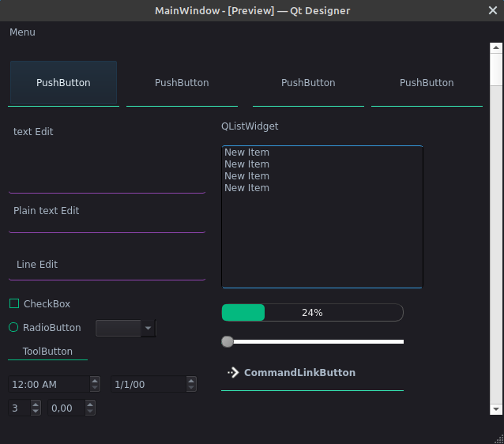

# NewQtDarkTheme
## _The best dark theme for Qt Apps_

QtDarkTheme is as the name states a modern, simple and beautiful dark theme you can use to design your Qt App.
supports many Qt Widgets:
- PushButtons
- All TextInputs(TextEdit/LineEdit/PlainTextEdit)
- ✨Progressbar/ListWidget
## Screenshot


## Installation

```sh
git clone https://github.com/Oussama1403/NewQtDarkTheme
```

## How to use

For PyQt5 Apps:
to load an external .qss file:
```python
style="DarkStyle.qss"
with open(style,"r") as s:
    self.setStyleSheet(s.read())
```
or just the open DarkStyle file,copy all the styles and paste it in stylesheet section in Qt Designer.
## Development

Want to contribute? Great!

i have styled Most of the widgets,If you find a widget that has not been styled,open an issue or submit a pull request of your design.
## License
MIT
**Free Software, Hell Yeah!**


